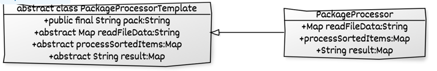

<h3 align="center">Packaging Challenge</h3>

<div align="">
You want to send your friend a package with different things.
<br>Each thing you put inside the package has such parameters as index number, weight and cost. 
<br>The package has a weight limit. 

Additional info and related constraints :
[Packaging Challenge](Packaging%20Challenge.pdf)
</div>

---

## 🎥 Processing Algorithm <a name = "demo"></a>

```
We can solve this problem by breaking it in smaller problems/sets.
Where we can pick each set and see if it can be added in the package 
(Sets whose total wight is less than that of package itself).
and calculate the cost.

With each subset there are two options
Option 1 Include Item - and calculate the cost achieved doing so
Option 2 Leave the Item - and calculate the cost achieved doing so
then we use the option which give the max cost from both option 1 and 2 respectively

We can recursively follow this approach for all Items and 
thereafter from all such set we can pick the set which provides the maximum cost.

```

## ✍️ Technical Implementation /Design Patterns<a name = "demo"></a>

From implementation perspective I had broken down the solution is small steps as follows  :-

1. Read the file data and process it
    1. Process the data such that all the items associated to a package weight is mapped in a map
       and
    2. Sort the Items based on the max cost and less weight if cost is same
2. Process the sorted Map to get the result of most valued item in package
3. Finally, get the Comma separated Items index number which are put in package.

**For this challenge I had used the "Template Method pattern"**

The Template Method pattern suggests that you break down an algorithm into a series of steps,
<br> turn these steps into methods, and put a series of calls to these methods inside a single
template method.
<br>The steps may either be abstract, or have some default implementation.
<br>To use the algorithm, the client is supposed to provide its own subclass, implement all abstract
steps,
<br> but not the template method itself.

The Abstract class **PackageProcessorTemplate.java**
<br>declares methods that act as steps for the algorithm,
<br>as well as the actual template method which calls these methods in a specific order.
<br>The steps may either be declared abstract or have some default implementation.

Concrete Classes **PackageProcessor.java** overrides all the steps, but not the template method
itself.



**Data Structures**
<br>We have used LinkedHashMap<String,List>

1. With Key of type string representing the max weight of package and
2. Value as List of Items that we are associated to that weight of package

````
e.g for below line in File Map would look like as follows
81 : (1,53.38,€45) (2,88.62,€98) (3,78.48,€3) (4,72.30,€76) (5,30.18,€9) (6,46.34,€48)

Key | Value
----| -------------
81  | 1,53.38,€45
    | 2,88.62,€98
    | 3,78.48,€3
    | 4,72.30,€76
    | 5,30.18,€9
    | 6,46.34,€48

````

3. The Challenge has a constraint of _**prefer to send a package which weighs less in case there is
   more than one package with the same price**_
   <br>Thus I had overridden compareTo method in Item object and sort the Item List using the
   asked constraints.

## 📝️ Note

I had implemented this challenge using recursive approach
<br>One of the caveat with this approach is that we evaluate the same set of data multiple times.
<br>We can improve that by caching the result of each set and use it later
<br>when the same set is encountered while evaluating the optimum value of other sets.
<br>This can be done using an iterative approach

Since the library is implemented using the Template method behavioral pattern
<br>we can also write a new Concrete class and override the process method and
<br>implement it with the caching mechanism as explained above.

<br>I suppose it gives an idea of how useful Template Method Pattern can be with such use cases
where the client have freedom of overriding how to process the given problem with different
constraints as applicable or changing how to see the result etc.
<br>and the creator of library have control on the order/sequence of steps that need to be followed
before we get the end result.

